# 脚本程序设计 

**部署在[这里](http://123.57.223.232/)**

## 基本功能

### 新建事项

点击右下角十字会弹出新建事项的会话。

###  删除事项

向右滑动事项条目会显示删除按钮。

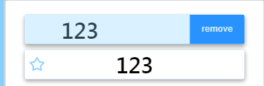

###  展示列表

页面中展示事项列表，可以根据上方筛选条件分别展示所有的、正在进行的或者已经完成的事项。已经完成的事项会用“变淡+删除线”的方式展示。

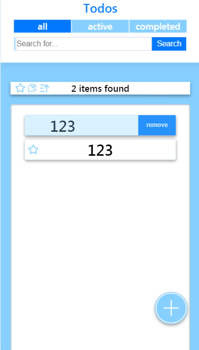

###  全部完成、取消、反转、删除

页面支持批量操作。可单击统计栏（页面中“* items left”）开始批量操作。点击Select All框，即可选中所有事项，之后点击批量操作按钮就可对所有事项完成四项批量操作。

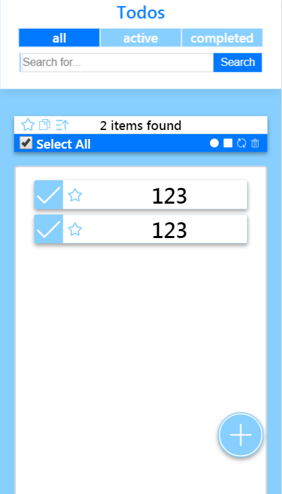

### 删除已完成

同上，在单击已完成选项卡后批量选择所有条目后删除即可。在高级功能中有**直接删除所有已完成事项**的方法。

## 高级功能

### 编辑单条Todo

长按Todo项目，会弹出编辑会话，用户可在此编辑。单击Todo后会弹出Todo详情，可在其中改变Todo状态。

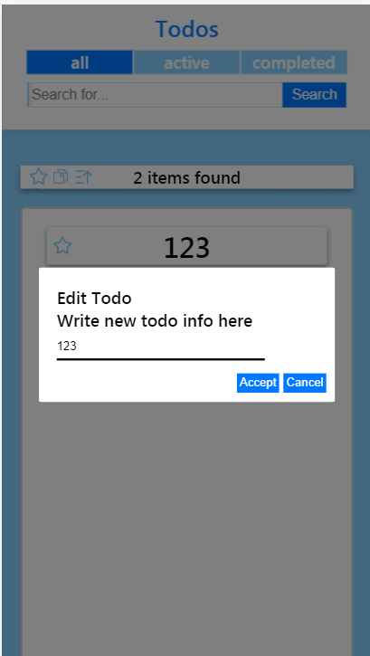

### 批量操作

除了基本功能中介绍的针对全部Todo的行为外，批量操作允许选中部分条目进行激活、完成、反转和删除操作。

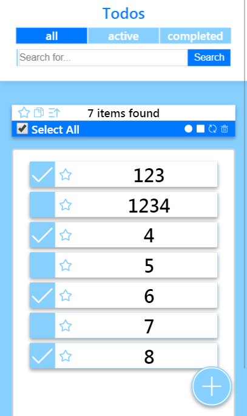

### 搜索

页面允许进行关键字搜索，搜索后的关键字展示在搜索栏左侧，单击关键字或在搜索栏为空的情况下点击搜索按钮都将解除搜索。

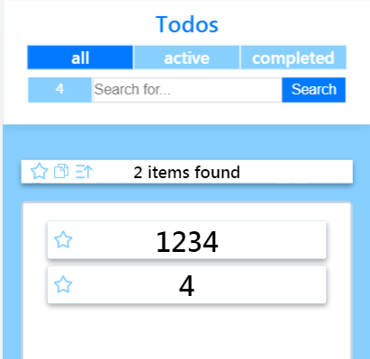

### 星标

页面允许用户对单条Todo进行星标/取消星标操作。用户也可以点击统计栏的星标按钮进行筛选，使页面仅展示星标项目。

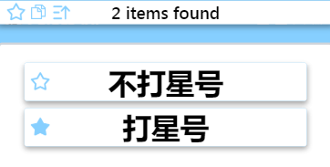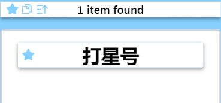

### 创建时间

页面会记录每条Todo的创建时间，单击单条Todo后会展示。

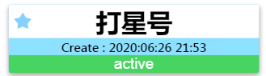

### 按创建时间/Todo名称/DDL排序

页面默认按照Todo项目的名称排序，点击统计栏的图表可以切换为按照创建时间或按照DDL排序。

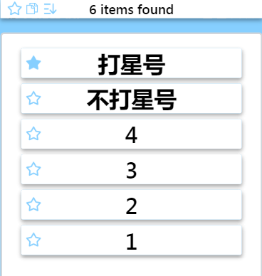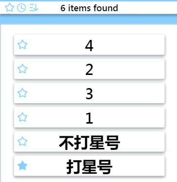

(分别为按名称排序和按时间排序)

### 切换升降序

可以点击统计栏的升降序图表改变排序的升降序。

（分别为正序和倒序）

### 复合过滤与批量操作

如上所述，本页面提供三种过滤机制：对项目状态的过滤（完成、未完成、全部），关键字搜索和星标过滤，这三种过滤既可单独使用，也可复合使用。同时，批量操作也可以应用在过滤后的条目上。

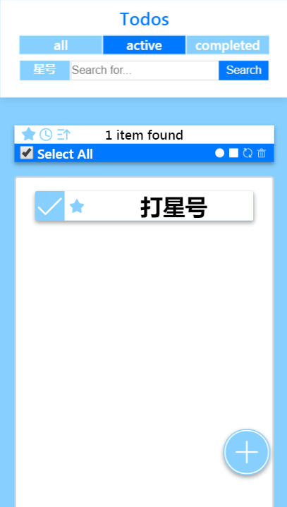

### DDL设置

事项可以设置DDL

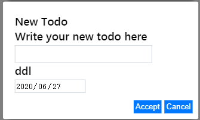

### 过期提醒

已过期且未完成事项会有特殊提醒

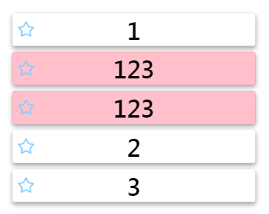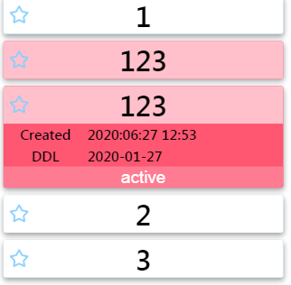

### 删除已完成

除了基本功能中介绍的方法外，页面还支持滑动上方的completed标签，亮出clear后清空所有已完成事项

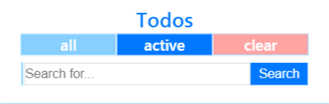